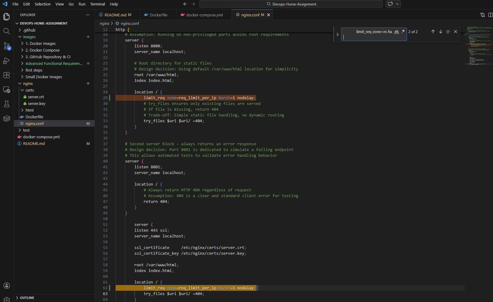

# Devops Home Assignment

## Overview

This project implements a Docker-based Nginx service with automated testing and CI integration.

It includes:
- A custom Ubuntu-based Nginx image
- A separate Python test image
- Docker Compose orchestration
- GitHub Actions CI pipeline
- Image size optimizations

## Table of Contents
- Overview
- Nginx Image
- Test Image
- Docker Compose
- CI
- Image Optimization


## Project Structure

```text
Devops-Home-Assignment/
│
├── nginx/
│   ├── Dockerfile
│   ├── nginx.conf
│   └── html/
│       └── index.html
│
└── README.md
```


The nginx directory contains all files required to build the custom Nginx Docker image, including configuration and static HTML content.


### Custom HTML Response

The first Nginx server block returns a custom static HTML page 
to fulfill the requirement of serving a custom HTML response.


### Nginx Configuration

Two server blocks are defined inside nginx.conf:

- Server 1 (port 8080): serves a custom static HTML page to fulfill the requirement of returning a custom HTML response.
- Server 2 (port 8081): always returns HTTP 404 error to fulfill the requirement of returning an HTTP error response.

Ports 8080 and 8081 were chosen to avoid requiring root privileges (as ports below 1024 require elevated permissions) and to clearly differentiate between the two server behaviors.

HTTP 404 was selected as the error response because it is simple, widely recognized, and clearly indicates a non-successful request.


### Dockerfile (Nginx Image)

- Base image is Ubuntu 22.04 as required.
- Nginx is installed via apt using `--no-install-recommends`.
- apt cache is removed to reduce image size.
- Nginx runs in the foreground using `daemon off;` to keep the container running.

.png>)

### Build the Image

```bash
docker build -t devops-nginx:1 -f nginx/Dockerfile nginx
```


This command builds the custom Nginx Docker image based on Ubuntu 22.04.


### Run the Container
```bash
docker run --name devops-nginx -d -p 8080:8080 -p 8081:8081 devops-nginx:1
```
The container is started in detached mode (-d).
Ports 8080 and 8081 are mapped from the container to the host machine.


### Verify Functionality
```bash
curl http://localhost:8080
curl -i http://localhost:8081
```
Expected behavior:
- `http://localhost:8080` returns the custom HTML page.
- `http://localhost:8081` returns HTTP 404 error.


### Cleanup
```bash
docker stop devops-nginx
docker rm devops-nginx
```
This step stops and removes the container after verification.


## Updated Project Structure
```text
Devops-Home-Assignment/
│
├── nginx/
│   ├── Dockerfile
│   ├── nginx.conf
│   └── html/
│       └── index.html
│
├── test/
│   ├── Dockerfile
│   ├── requirements.txt
│   └── test.py
│
└── README.md
```
The test directory contains a separate Docker image used to validate
the Nginx server behavior.


### Test Script Validation Logic

The test script validates:

- Port 8080 returns HTTP 200 and contains the expected HTML content.
- Port 8081 returns HTTP 404 error.

If any validation fails, the script exits with a non-zero exit code.


### Design Decisions

- Python was chosen for simplicity and readability.

- python:3.12-slim was selected to keep the image size small.

- The requests library is used for clean and reliable HTTP validation.

- Both status code and content validation are performed to ensure correct behavior, not just connectivity.

## Test Image

A separate Docker image is used to run an automated Python test script.
The script sends HTTP requests to both Nginx ports and validates status codes and response content.
If any validation fails, it exits with a non-zero exit code.


## Docker Compose

A single `docker-compose.yml` file is used to orchestrate both services:

- **nginx**: builds the Ubuntu-based Nginx image and exposes ports `8080` and `8081`.
- **test**: builds a separate Python test image that sends HTTP requests to the nginx service.

The test container connects to the nginx container using the service hostname `nginx` on the internal Docker Compose network.


## Docker Compose Test Run

The `test` service runs an automated Python script that validates the Nginx service behavior:

- Port 8080 returns HTTP 200 and contains the expected HTML content.
- Port 8081 returns HTTP 404 error.

Run:
```bash
docker compose up --build --abort-on-container-exit
```
- build ensures both images are built.
- abort-on-container-exit stops the stack when the test container finishes.


## Cleanup
```bash
docker compose down
```


## GitHub repository that includes all required files and configuration.

GitHub Repository

A GitHub repository was created that includes all required files and configuration for this project.

The repository contains:

- nginx/ – Nginx Docker image (Ubuntu-based)

- test/ – Test Docker image (Python-based)

- docker-compose.yml

- .github/workflows/ci-workflow.yml

- README.md


## CI (GitHub Actions)

A GitHub Actions workflow (`.github/workflows/ci-workflow.yml`) runs on every push and pull request.

It performs:
- Builds and runs the project using Docker Compose.
- If tests pass, it uploads an artifact containing a file named `succeeded`.
- If tests fail, it uploads an artifact containing a file named `fail`.

.png>)

## Committing and Pushing the Workflow
The workflow file was committed and pushed using:
```bash
git add .github/workflows/ci-workflow.yml
git commit -m "Add GitHub Actions CI workflow"
git push
```


## CI Execution Result
After pushing the workflow file, GitHub Actions automatically triggered a CI run.

Because all tests passed:

The test container exited with code 0.

The workflow detected success.

An artifact named test-result was uploaded.

The artifact contains a file named succeeded.

This satisfies the requirement:

If tests pass, publish an artifact containing a file named succeeded.
If tests fail, publish an artifact containing a file named fail.


## Docker image sizes as small as possible.


The relatively small image sizes were achieved by:

- Using `--no-install-recommends` in the Ubuntu-based Nginx image.(in nginx/Dockerfile).
- Removing apt cache after installation.(in nginx/Dockerfile).
- Using `python:3.12-slim` for the test image.(in test/Dockerfile).
- Installing Python dependencies with `--no-cache-dir`.(in test/Dockerfile).

These optimizations reduce unnecessary layers and prevent storing temporary installation files inside the final images.


## Advanced Functional Requirements 

## HTTPS with Self-Signed Certificate

### Generate Certificate and Private Key

The certificate and key were generated using OpenSSL inside a temporary Alpine container (to avoid installing OpenSSL locally):
```bash
docker run --rm -v ${PWD}\nginx\certs:/certs alpine sh -c \
"apk add --no-cache openssl && \
openssl req -x509 -nodes -newkey rsa:2048 -days 365 \
-keyout /certs/server.key -out /certs/server.crt \
-subj '/CN=localhost'"
```
This creates the following files:

- nginx/certs/server.crt — self-signed certificate

- nginx/certs/server.key — private key


I added an additional server block that listens on port 443 with SSL enabled and serves the same HTML content as the HTTP server on port 8080.

I configured the paths to the self-signed certificate and private key used by Nginx for HTTPS.


I copied the self-signed certificate and private key into the Docker image so that Nginx can load them at runtime.

I exposed port 443 in the Nginx Docker image to support HTTPS traffic.

I mapped host port 443 to container port 443 in docker-compose so HTTPS can be accessed from the local machine.


### Verify HTTPS

```bash
docker compose up --build -d nginx
curl.exe -k https://localhost/
```


The -k flag allows connection using a self-signed certificate.

Expected result: HTTP 200 response with the same HTML page as port 8080.

## Rate Limiting

Rate limiting was configured per client IP at 5 requests per second and verified by sending 20 rapid requests and observing blocked responses (503).

I configured a rate limiting zone per client IP with a limit of 5 requests per second.


Rate limiting is enforced on the main endpoints using limit_req inside the location block.
The limit is configured per client IP using limit_req_zone with a rate of 5 requests per second.



The rate limit was tested by sending 20 rapid HTTP requests:

```bash
1..20 | % { curl.exe -s -o NUL -w "%{http_code}`n" http://localhost:8080/ }
```


Observed behavior:

Initial requests returned 200 OK

Subsequent requests returned 503 Service Unavailable

This confirms that the rate limit of 5 requests per second is enforced correctly.

## Validate the rate limiting behavior

To validate that the Nginx rate limiting configuration works correctly,
the test script (test/test.py) was extended to simulate a burst of rapid requests.

After validating that port 8080 returns HTTP 200 and the expected HTML content,
the test script now:

Sends 20 rapid HTTP requests to http://nginx:8080/

Counts how many responses return 503 or 429

Fails the test if no rate limiting is triggered

Passes if at least one request is limited

This ensures the rate limit of 5 requests per second is actively enforced.


When running:
```bash
docker compose up --build --abort-on-container-exit
```

The test output should include:
```bash
Testing rate limiting on http://nginx:8080/ with 20 rapid requests...
[PASS] Rate limiting triggered successfully (X/20 requests were limited)
```


This confirms:

- Rate limiting is active

- The test script correctly detects it

- The CI pipeline will fail if rate limiting stops working

## CI validates rate limiting as part of the automated tests.

After extending the test script to validate the rate limiting behavior,
a new commit was pushed to the repository. GitHub Actions automatically triggered the CI workflow.

# CI Result

- The workflow completed successfully.

- The Docker images were rebuilt.

- Docker Compose was executed.

The extended test script validated:

- HTTP 200 behavior

- HTTP 404 behavior

- Rate limiting enforcement

- The test container exited with code 0.

- An artifact named test-result was uploaded.

This confirms that:

Rate limiting is correctly enforced.

The extended test logic works properly.

The CI pipeline validates the new functionality automatically.


## Rate Limiting Configuration

To enhance server stability and prevent abuse, rate limiting was configured in the Nginx server.

---

### How it works

Rate limiting is implemented using the `limit_req_zone` and `limit_req` directives in `nginx.conf`.

At the `http` level, the following configuration is defined:

```bash
limit_req_zone $binary_remote_addr zone=req_limit_per_ip:10m rate=5r/s;
```
Explanation:

- $binary_remote_addr
Limits requests per client IP address.

- zone=req_limit_per_ip:10m
Allocates 10MB of shared memory to track request counters per IP.

- rate=5r/s
Allows a maximum of 5 requests per second per IP address.

Inside each relevant server block (8080 and 443), rate limiting is enforced within the location block:
```bash
location / {
    limit_req zone=req_limit_per_ip nodelay;
    try_files $uri $uri/ =404;
```


Explanation:

- limit_req zone=req_limit_per_ip
Applies the previously defined rate limiting zone.

- nodelay
Excess requests are rejected immediately instead of being delayed.

When the request rate exceeds the defined threshold, Nginx responds with HTTP 503 (Service Temporarily Unavailable).

## Rate Limiting Test Validation

The automated test script was extended to validate the rate limiting behavior.

It sends 20 rapid requests to the main endpoint and verifies that at least one request is rejected with HTTP 503 or 429.

This ensures that rate limiting is actively enforced and functioning correctly.


## How to change the rate limit threshold

To modify the allowed request rate, update the following line in nginx.conf:

```bash
limit_req_zone $binary_remote_addr zone=req_limit_per_ip:10m rate=5r/s;
```


After modifying the configuration, rebuild and restart the containers:

```bash
docker compose down
docker compose up --build
```
The new rate limit will take effect immediately after the rebuild.


